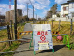

### Le 11 mars 2011 commençait la catastrophe nucléaire de Fukushima – que se passe t-il depuis ?

En une phrase: la catastrophe est loin d'être maîtrisée !

[Pour en savoir plus »](actualite/nouvelles/20150304-11-mars-2011-fukushima)
