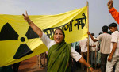

### Inde: ils disent NON!

  

Reportage sur la résistance des riverains la plus grosse centrale nucléaire au monde prévue à Jaitapur.

Mercredi 29 avril à Bulle  
Mercredi 06 mai à Genève   
Mercredi 08 mai Martigny   
Mercredi 13 mai à Morges   
Lundi 18 mai à Neuchâtel  

En présence du réalisateur.

[Tous les détails »](actualite/nouvelles/20150417-jaitapur-live)

### Le 11 mars 2011 commençait la catastrophe nucléaire de Fukushima – que se passe t-il depuis ?

En une phrase: la catastrophe est loin d'être maîtrisée !

[Pour en savoir plus »](actualite/nouvelles/20150304-11-mars-2011-fukushima)
