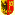

## Le comité de l'association "Sortir du Nucleaire"

{{`%csv%page/association_qui,page_association_qui%`}}

Vous pouvez envoyer un message aux membres du comité en cliquant sur leur nom.

## Les coordinations antinucléaires dans les cantons

###  Fribourg

Comité antinucléaire Fribourg  
<http://fr-fr.facebook.com/antinuclear.fr>

###  Genève

ContrAtom  
[www.contratom.ch](http://www.contratom.ch/)

###  Jura

Alliance jurassienne Non au nucléaire AJUNN  
[www.ajunn.ch](http://www.ajunn.ch/)

###  Neuchatel

Alliance neuchâteloise Non au nucléaire ANNN  
_Association en veille entre les périodes de votations_

###  Valais

Alliance valaisanne Sortir du nucléaire  
[Marie-Therese.Sangra@wwf.ch](mailto:Marie-Therese.Sangra@wwf.ch)

###  Vaud

Coordination énergie Vaud  
[roger.nordmann@parl.ch](mailto:roger.nordmann@parl.ch)

## Alliance Suisse "Non au Nucleaire"

"Sortir du Nucléaire" est une des 37 organisations membres de l’Alliance «Non au nucléaire», qui regroupe les plus importants éléments du mouvement anti-nucléaire en Suisse, composé d’organisations de protection de l’environnement, de différents partis et autres groupements d’intérêts.  
[non-au-nucleaire.ch](http://non-au-nucleaire.ch)

## Réseau Sortir du Nucléaire (France)

Nous sommes aussi membre de cette fédération française qui regroupe 923 associations anti-nucléaires  
[www.sortirdunucleaire.org](http://www.sortirdunucleaire.org)
