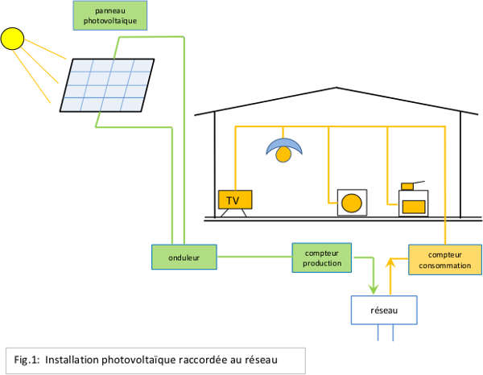
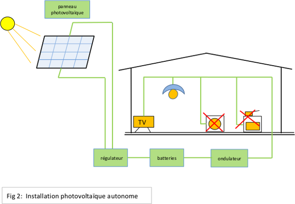
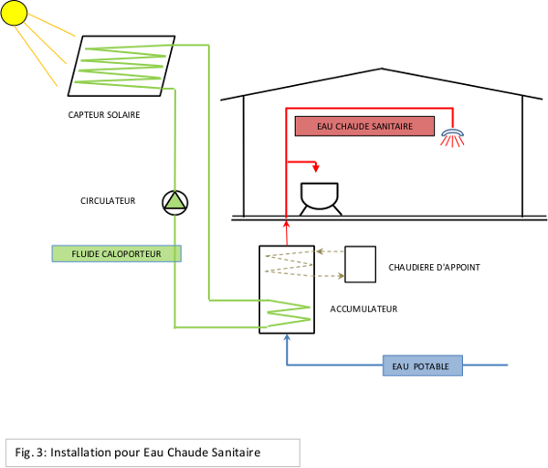
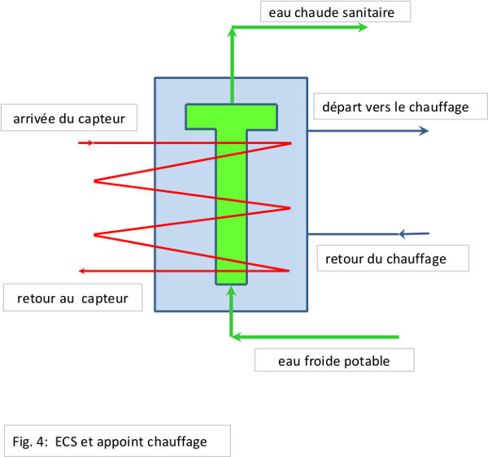

# L'énergie solaire

{.cadre}
**Le soleil nous envoie en une heure autant d'énergie que toute l'humanité ne consomme en une année.  
Et en plus, le soleil ne nous n'envoie pas de facture - autant en profiter!**

Il existe plusieurs possibilités pour profiter de cette énergie:

- Le solaire photovoltaïque, pour produire de l'électricité
- Le solaire thermique, pour chauffer de l'eau, soit pour l'eau chaude sanitaire, soit pour l'appui du chauffage.

## Le solaire photovoltaïque

Une technologie accessible à tout propriétaire de maison ou de chalet à la toiture bien orientée:

Des panneaux photovoltaïques, composés de cellules solaires qui transforment le rayonnement solaire en électricité, sont installés sur les pans de toits orientés plus ou moins vers le sud.

Il y a deux applications différentes:

- Les installations raccordées au réseau (voir fig. 1)
- Les installations photovoltaïques autonomes (voir fig. 2)

## Les installations raccordées au réseau

L'électricité à courant continu produite par les modules photovoltaïques est convertie par un onduleur en courant alternatif 230V/50 Hz compatible avec le réseau du distributeur électrique.

L'électricité ainsi produite est entièrement injectée dans le réseau du distributeur, en passant par un compteur de production qui permet d'établir la quantité de courant fourni au réseau.

L'électricité consommée dans la maison est fournie comme d'habitude par le réseau et facturée sur base du compteur de consommation.

1 m2 de panneau, bien orienté vers le sud, produit dans nos régions environ 150 kWh par année.

Un ménage moyen (sans chauffage électrique ni chauffe-eau électrique) consomme environ 4000 kWh par année.

Avec une installation de 27 m2 on pourrait donc produire (en moyenne sur l'année) autant d'électricité que ce ménage moyen consomme.

Cependant une installation plus petite (en fonction de la surface disponible ou de l'investissement envisagé) peut aussi se justifier.

Pour calculer le potentiel de votre projet visitez le site  
<http://www.swissolar.ch/fr/solardach-rechner/>

### Le potentiel du photovoltaïque pour la Suisse

Equiper avec des panneaux solaires

- 30 % des toits existants (ceux qui sont bien orientés, qui ne se trouvent pas dans des zones protégées et ne sont pas ombragés)
- produiraient 10 % de notre consommation d'électricité.
- Cela correspond à 25% de la production total du nucléaire Suisse, ou bien par exemple à la production des centrales Beznau I et Beznau II.

### Et la fameuse énergie grise ?

Et la fameuse énergie grise ?

Des études scientifiques reconnues montrent que l'énergie investie dans la production d'une installation solaire est récupérée dans nos régions en moins de trois ans.

Avec une durée de vie d'au moins 30 ans (les panneaux sont garantis 25 ans), une installation photovoltaïque produit de ce fait au moins dix fois plus d'énergie que celle qui est investie dans sa fabrication.

Grâce au développement continuel de la technologie photovoltaïque ce facteur de « retour énergétique» continu à s'améliorer encore.

### Combien coûte une installation photovoltaïque ?

Le coût des installations photovoltaïques sont en baisse spectaculaire ces dernières années. Si vous envisagez la réalisation d'une telle installation n'hésitez donc pas à demander des offres à des entreprises expérimentées afin de connaître les prix actuels.

Le site suivant vous permettra de les identifier  
<http://www.swissolar.ch/fr/waerme-von-der-sonne/les-pros-du-solaire>

(A titre d'information, une installation de 27m2 couvrant la consommation totale en électricité d'un ménage moyen (voir ci-dessus) coûtait en 2012 environ CHF 22'000.-)

### A combien revient l'électricité photovoltaïque ?

Le prix de revient du kWh produit est aussi en baisse remarquable, on attend que d'ici quelques années il sera au même niveau que le mix de courant que nous consommons aujourd'hui.

### Rétribution a prix coûtant

Pour promouvoir les énergies renouvelables, la confédération a instauré la rétribution à prix coûtant du courant injecté (RPC). La RPC compense la différence entre le coût de la production et le prix du marché, garantissant ainsi aux producteurs de courant renouvelable un prix qui correspond à leurs coûts de production.

A cause du grand nombre d'inscriptions de projets photovoltaïque, l'octroi de ces aides fédérales a atteint son plafond et les nouveaux projets sont inscrits sur une liste d'attente.

Pour plus de détails concernant l'RPC, veuillez consulter les sites officiels suivants:  
<http://www.bfe.admin.ch/themen/00612/02073/index.html?lang=fr>  
[http://www.bfe.admin.ch/energie/00588/00589/00644/index.html?lang=fr&msg-id=43276](http://www.bfe.admin.ch/energie/00588/00589/00644/index.html?lang=fr&msg-id=43276)

### Déductions fiscales

Dans la plupart des cantons, les investissements faits pour une installation solaire peuvent être déduits de sa déclaration d’impôts comme frais d'entretien.

## Les installations photovoltaïques autonomes

Dans le cas d'un bâtiment isolé (cabanon, chalet d'alpage) non raccordé au réseau électrique, on est obligé de stocker localement l'énergie produite durant la journée. La seule solution consiste alors à installer des batteries.

Pour charger correctement les batteries il faut installer un contrôleur, et pour pouvoir alimenter des consommateurs standards il faut aussi installer un onduleur comme dans le cas précédant.

Vu le coût élevé de ces batteries, une telle installation ne peut être considérée pour l'alimentation de l'éclairage et éventuellement d'un ordinateur ou d'une radio ou TV.

## Le solaire thermique

{.cadre}
**Les boilers électriques installés en Suisse consomment annuellement 2500 GWh, ce qui correspond à peu près à la production de Mühleberg**

Et pourtant, avec une installation simple, facilement à installer dans des maisons existantes ou en construction, le soleil peut fournir une part importante de notre consommation d’eau chaude sanitaire, et ainsi réduire la consommation d'électricité et faire des économies substantielles.

Une telle installation consiste principalement en :

Des capteurs thermiques, composés d'un circuit de tubes en cuivre couvert par un verre spécial. Un fluide caloporteur circulant dans ce circuit à l’aide d'un circulateur est chauffé par le soleil et transporte la chaleur dans l’accumulateur.

Pour couvrir le manque de soleil en cas de mauvais temps prolongé, la chaudière du chauffage existant fournit la chaleur manquante par un circuit d’appoint.

Une installation typique pour une famille de 4 personnes répond aux spécifications suivantes :

- Surface des capteurs: 4 m2
- Volume de l’accumulateur: 400 litres

### Potentiel d'eau chaude solaire

Avec une telle installation, les besoins en eau chaude sanitaire annuels de cette famille peuvent être couverts à environ 60 %. Le reste est couvert par la chaudière existante.

(Il serait possible d’augmenter la part de couverture par le solaire en augmentant la surface des capteurs ainsi que le volume de l’accumulateur, mais ce gain additionnel ne justifierait pas l’augmentation des coûts de l’installation.)

Pour calculer le potentiel de votre projet visitez le site  
<http://www.wwf.ch/fr/agir/gestes/habitat2/calculateur_solaire/>

### Combien coûte une installation solaire thermique pour l'eau sanitaire?

Pour obtenir des prix actualisés, veuillez contacter un installateur spécialisé.

Le site suivant vous aidera :  
<http://www.swissolar.ch/fr/waerme-von-der-sonne/les-pros-du-solaire>  
(A titre d'information, une installation de 4 m2 comme décrit ci-dessus coûtait en 2012 environ CHF 15'000.-)

### Déductions fiscales

Dans la plupart des cantons, on peut déduire de sa déclaration d’impôts les investissements faits pour une installation solaire comme frais d'entretien.

### Subventions

La plupart des cantons font la promotion de telles installations en les subventionnant.

Dans le canton de Vaud par exemple, cette subvention s'élève actuellement à CHF 1'800.- pour une installation de 4 m2 à 10 m2.

Pour des informations actualisées, veuillez consulter le site  
<http://www.swissolar.ch/fileadmin/files/swissolar/f%C3%B6rderung/Infodossier_Foerderung_Solarthermie.pdf>

Pour des informations valables pour le canton de Vaud, consultez  
<http://www.vd.ch/fr/autorites/departements/dse/environnement-et-energie>

## Appoint du chauffage

Une installation de capteurs solaires thermiques peut aussi fournir une partie de la chaleur nécessaire au chauffage. Le principe reste le même que celui décrit ci-dessus, mais tant la surface des capteurs que le volume de l'accumulateur doivent être beaucoup plus grandes. Il faut donc avoir suffisamment de place disponible sur le toit pour les capteurs ainsi qu'à la cave pour l'accumulateur.

En plus, l'accumulateur doit être du type combiné afin de séparer le circuit d'eau chaude sanitaire de celui d'appoint du chauffage.

