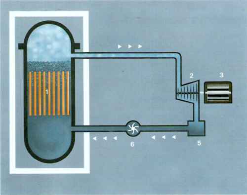
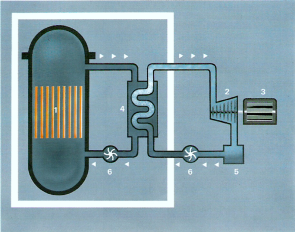
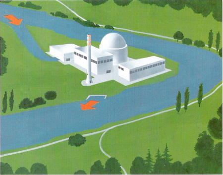
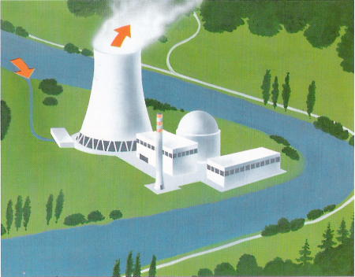

# Fonctionnement d'une centrale

Dans le _réacteur à eau bouillante_, l'eau circulant dans le cœur du réacteur est amenée à ébullition et se transforme en vapeur, qui alimente directement la turbine de la centrale; cette turbine est couplée à un alternateur, qui convertit l'énergie mécanique en énergie électrique.

Dans le _réacteur à eau sous pression_, l'eau est maintenue à une pression telle que, malgré la haute température, elle ne peut bouillir. Dans un échangeur de chaleur, qu'on appelle aussi générateur de vapeur, la chaleur est transmise à un deuxième circuit d'eau où de la vapeur se forme. C'est cette vapeur qui va actionner la turbine, comme dans un réacteur à eau bouillante.

Dans les deux types de réacteurs, la vapeur, au sortir de la turbine, est acheminée dans un _condenseur_ où elle se condense pour former de l'eau. Du condenseur, l'eau est pompée dans le réacteur ou dans l'échangeur de chaleur.

1. Cœur du réacteur
2. Turbine à vapeur
3. Alternateur
4. Générateur de vapeur
5. Condenseur
6. Pompe

# Centrales nucléaires et refroidissement

Pour des raisons inhérentes à la physique même, toutes les usines électriques thermiques -- qu'elles soient exploitées au mazout, au charbon, au gaz ou encore grâce à l'énergie nucléaire -- ne peuvent convertir en électricité qu'environ un tiers de la chaleur produite. La chaleur résiduelle doit être évacuée soit dans des cours d'eau, soit au moyen de tours de refroidissement.

Tout en actionnant la turbine, la vapeur, bien que se refroidissant, n'en contient pas moins encore beaucoup de chaleur. Après avoir passé les paliers successifs de la turbine, elle est acheminée dans le condenseur où elle se refroidit toujours plus pour finir par se condenser. L'eau résultant de cette condensation est réutilisée pour la production de vapeur. Le refroidissement de la vapeur dans le condenseur est assuré par circulation d'eau froid qui, ce faisant, se réchauffe. Si cette eau de refroidissement est prélevée d'une rivière à laquelle elle est ensuite restituée, la température de ce cours d'eau subit alors un très léger relèvement. Cette manière de produire du froid dans le condenseur s'appelle _refroidissement direct par eau de rivière_,

Pour les sites de centrales qui ne disposent pas d'assez d'eau de refroidissement ou lorsque, vu sa qualité insuffisante, on se voit dans l'obligation de renoncer au refroidissement direct par eau de rivière, la solution mieux appropriée est alors le _refroidissement en circuit indirect autonome_.

Ce système achemine l'eau de refroidissement, réchauffée au passage à travers le condenseur, dans une tour de refroidissement où sa température est abaissée, pour la repomper ensuite en tant qu’eau froide dans le condenseur. Une petite partie de l'eau du circuit s'évapore et est rejetée dans l'atmosphère sous forme de vapeur d'eau pure. Cette quantité d'eau doit être compensée par prélèvement dans une rivière.
