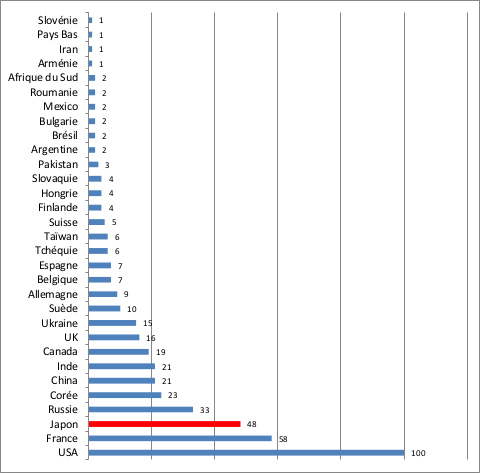
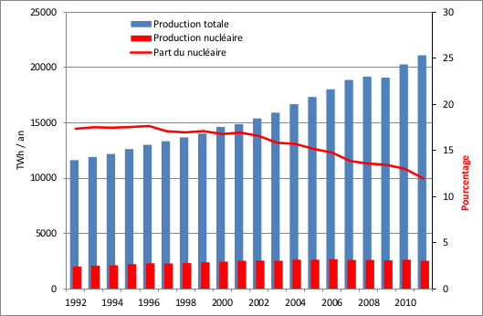

# Le nucléaire dans le monde

## Le nombre de réacteurs nucléaires dans le monde

(avril 2014)

  
Source: eia

**Remarque concernant le Japon** :  
En mars 2014, trois années après la catastrophe de Fukushima, il n'y avait plus aucun réacteur en opération. Ils apparaissent pourtant toujours dans cette statistique, parce qu'ils ne sont pas encore arrêtés définitivement

## Y-a-t'il vraiment une renaissance du nucléaire ?

  
Source: eia; Graphique: SdN

**Durant les 20 années de 1992 à 2011** :

- La production mondiale d'électricité a augmenté de 81 % (de 11'624 à 21'080 TWh / an)
- La production mondiale nucléaire a augmenté que de 25 % (de 2'015 à 2'517 TWh / an)
- **La part du nucléaire a donc baissé de 17.3% à 11.9 %**
