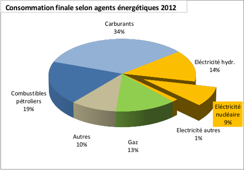

# Le nucléaire en Suisse

Dans notre pays, cinq centrales nucléaires participent à la production de notre électricité. Leur données techniques et statistiques sont les suivantes :

{{`%csv%page/nucleaire_suisse,page_nucleaire_suisse_tableau%`}}

Il faut considérer la production nucléaire d'électricité par rapport à tous les agents énergétiques:

L'électricité nucléaire ne représente que 9 % de toute la consommation d'énergie.  
Il devrait donc bien être possible de se passer de cette énergie dangereuse !
