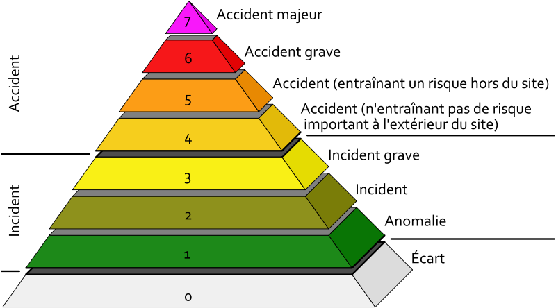

# Les risques d'accidents

L'historique de l'industrie nucléaire montre qu'il y a des multiples facteurs qui amènent fréquemment à des incidents qui souvent débouchent sur des accidents.

Heureusement pour l'humanité, la plupart de ces accidents n'ont pas résulté dans des catastrophes majeures, mais ça donne la fausse impression d'une technologie bien maîtrisée.

On peut distinguer les causes potentielles suivantes :

## Défaillance humaine

L'exemple classique est l'accident de Tchernobyl : un essai technique mal organisé a mené à la perte de contrôle et la conséquence était la catastrophe connue, avec des milliers de morts, des contrés entières empoisonnées à jamais, des maladies atroces des survivants et des descendants.

Pour en savoir plus: [l'accident de Tchernobyl](pourquoi/risques#tchernobyl)

## >Defaillance technique

Défaillance technique
Le cas le plus récent de défaillance technique concerne l'accident de Forsmark en Suède (2006), qui a montré que même une multiplication des systèmes de sécurité n’empêche pas  toujours une défaillance technique potentiellement catastrophique.

Pour en savoir plus: [l'accident de Forsmark](pourquoi/risques#forsmark)

## Les risques sismiques

La plus grande centrale nucléaire du monde, la centrale de  Kashiwazaki-Kariwa  au Japon, a souffert de dégâts importants lors d'un séisme en 2007. Malgré le fait que les Japonais sont des experts en sécurité parasismique, la centrale a dû être fermée. A ce jour, elle n’a toujours pas été remise en opération.

Pour en savoir plus: [l'accident de Kashiwasaki](pourquoi/risques#kashiwasaki)

## Les risques de terrorisme

Les centrales nucléaires ne résisteraient pas à une attaque terroriste comme celle des Twin Towers du 11 septembre 2001. La seule défense contre une telle attaque par des avions plein de kérosène qu'on a trouvé jusqu'ici est de cacher la centrale par un rideau de nuages artificielles! Les terroristes sont priés de bien vouloir s'annoncer bien à l'avance afin que ce rideau puisse être produit dans les délais.

Bien heureusement, ce type d'accidents ne s'est pas encore produit ! Mais rappelons que le rapport « Secret défense » de la France affirme que le nouveau réacteur français EPR ne résisterait pas à une attaque par avion !

## Les accidents nucléaires majeurs

Notons que cette liste n'est pas à jour, parce qu'il ne se passe pas une semaine sans un tel incident, dont chacun pourrait être la cause d'un accident majeur.

### 12.10.1957 Windscale (Grande-Bretagne)

Incendie à la centrale nucléaire de Windscale. L'accident se classe au __niveau 5__ sur l'échelle internationale des événements nucléaires (INES). À la suite d'un incident provoqué lors d'une opération d'entretien du graphite, des produits de fission, essentiellement de l'iode 131, sont rejetés à l'extérieur. Aucune mesure d'évacuation n'a été prise, mais les autorités compétentes prennent les mesures suivantes pour maîtriser le danger : interdiction de la consommation de certains produits et contrôle et __arrêt des livraisons de lait pendant deux mois__ sur une zone de 500 km2. Sur les 238 personnes examinées, 126 sont légèrement contaminées au niveau de la thyroïde.

En 1983, un documentaire de la télévision britannique révélait que dans le village de Seascale, situé non loin de Sellafield, __le taux d'enfants atteints de cancer était dix fois plus élevé que la moyenne nationale__.

Selon le journal Le Monde du 2 janvier 1988, l'ancien premier ministre conservateur britannique, Harold Macmillan, avait ordonné d'étouffer un rapport détaillé sur les causes d'un grave incendie qui s'était produit à l'intérieur de l'usine de retraitement des déchets nucléaires de Windscale.

### 17 octobre 1969 Centrale nucléaire de Saint-Laurent-des-Eaux (France)

Centrale nucléaire de Saint-Laurent-des-Eaux , Loir-et-Cher, en France. Un accident entraîne la fusion de cinq éléments combustibles dans le réacteur A1. Lors du déchargement, les opérateurs ont ordonné de charger un canal d'Uranium et de graphite. Le réacteur est resté un an à l'arrêt pour un coût de 20 millions de francs (un peu plus de trois millions d'euros). L'événement est qualifié d'incident par EDF; selon l'échelle INES actuelle, il s'agit d'un accident qui se situe au __niveau 4__.

### 21 janvier 1969 Lucens (Suisse)

L'éclatement d'un tube de force provoque une impulsion de courant et le réacteur (un petit appareil expérimental construit dans une caverne rocheuse) explose. Il est totalement détruit. La majeure partie des substances radioactives est contenue dans la caverne.

### 28 mars 1979 Three Mile Island (USA)

Suite à une panne des pompes d'alimentation en eau du circuit secondaire de l'un des réacteurs, un enchaînement de défaillances mécaniques, d'erreurs humaines et de défauts de conception, entraîne la [fusion du coeur](http://fr.wikipedia.org/wiki/Fusion_du_coeur). L'enceinte de confinement étant restée intègre, le relâchement de produits radioactifs dans l'environnement est resté faible. L'accident de [Three Mile Island](http://fr.wikipedia.org/wiki/Three_Mile_Island) est classé au niveau 5 sur l'échelle internationale des événements nucléaires ([INES](http://fr.wikipedia.org/wiki/INES)).

### 26 avril 1986, Tchernobyl (Ukraine)

Accident de __niveau 7__ selon l'échelle INES. L'accident est survenu dans la centrale nucléaire Lénine située sur les rives du Dniepr à environ 15 km de Tchernobyl et 110 km de Kiev, près de la frontière avec la Biélorussie. Suite à une série d'erreurs humaines et en raison de défauts de conception, le réacteur n°4 subit une fusion du coeur puis une explosion provoquant la libération de grandes quantités de radio-isotopes dans l'atmosphère. Les autorités évacuent environ 250 000 personnes de Biélorussie, de Russie et d'Ukraine. Plusieurs centaines de milliers d'ouvriers (600 000 environ), les « liquidateurs » sont venus d'Ukraine, de Biélorussie, de Lettonie et de Russie pour procéder à des nettoyages.

### 19 octobre 1989 Vandellos (Espagne)

Un incendie se déclare dans la salle des turbines, provoquant indirectement une inondation et endommageant différents systèmes, notamment la réfrigération du réacteur. Cet incident est classé au __niveau 3__ de l'échelle INES. Le gouvernement espagnol a décidé la fermeture définitive du réacteur en novembre 1992 après qu'une fuite d'effluents liquides radioactifs eut pollué le canal voisin. En février 1996, 15 personnes sont contaminées par inhalation d'américium 241 alors qu'elles vident les piscines de combustible de la centrale.

### 18 avril 2005, Sellafield (Angleterre)

83 000 litres de combustible liquéfié fortement radioactif, contenant environ 20 tonnes d'uranium et de l'acide nitrique concentré se sont échappés d'une fissure dans un tuyau et se sont répandus dans une cuve en acier inoxydable contenant 200 kg de plutonium dans l'enceinte de l'usine de retraitement Thorp située à Sellafield. L'enquête a montré que la fuite est restée inconnue pendant neuf mois.

### 25 juillet 2006, Forsmark (Suede)

Incident classé de __niveau 2__ sur l'échelle INES : défaillance d'un système de secours de la tranche 1 de la centrale de Forsmark ; par précaution, deux réacteurs de la centrale d'Oskarshamn sont fermés[]. __« C'est le hasard qui a évité qu'une fusion du coeur ne se produise »__, affirme, dans le quotidien allemand TAZ du 3 août, Lars-Olov Höglund, qui a dirigé la construction de la centrale. « C'est l'évènement le plus dangereux depuis Three Mile Island et Tchernobyl », déclare-t-il le 2 août au quotidien suédois Svenska Dagbladet. Ole Reistad, directeur de l'institut norvégien de protection contre les rayonnements ionisants, déclare au TAZ que l'on est __« passé près de la catastrophe »__ et près de la défaillance de la dernière barrière de sécurité ; « une telle chose n'aurait jamais dû se produire ». Suite à cet incident, le ministère allemand de l'Environnement va vérifier « le plus rapidement possible » si cet incident survenu sur un réacteur nucléaire en Suède pourrait également se produire dans les centrales allemandes.

source : [Liste d'accidents nucléaires](http://fr.wikipedia.org/wiki/Liste_d%27accidents_nucl%C3%A9aires)

### 16 juillet 2007, Kashiwazaki-Kariwa (Japon)

La centrale de Kashiwazaki-Kariwa a subi un tremblement de terre d'intensité 6,8 dont l'épicentre était éloigné d'environ 10 kilomètres. Le séisme a causé un incendie maitrisé deux heures après le départ du feu, ainsi que des rejets d'eau contenant des éléments radioactifs dans la mer. Des fûts contenant des déchets de faible activité ont également été renversés dans la zone de stockage, répandant pour certains leur contenu sur le sol. Des traces de radioactivité ont aussi été détectées au niveau du système de ventilation du réacteur 7 ce qui tend à prouver que de faibles quantités de ces éléments ont été rejetées dans l'atmosphère. Suite au séisme, les réacteurs de la centrale ont été arrêtés le 18 juillet 2007. Le coût total du séisme pour la centrale est évalué à plus de 600 milliards de yens (plus de 3,6 milliards d'euros) sur l'année comptable qui prend fin en mars 2008, entrainant un déficit de 95 milliards de yens (570 millions d'euros) pour cette même année.

### 23 juillet 2008, site nucleaire du Tricastin (France)

Lors d'une opération de maintenance réalisée sur le réacteur 4, des substances radioactives se sont échappées contaminant très légèrement une centaine de salariés sur le site. En 2007, 842 alertes de niveau zéro (817 en 2006) et 86 de niveau 1 ont été signalées en France. Sur l'[échelle INES](http://fr.wikipedia.org/wiki/échelle_INES), ce niveau 1 correspond à une «anomalie», du type de celles survenues en juillet 2008 à [Romans-sur- Isere](http://fr.wikipedia.org/wiki/Romans-sur-Isère) (Drôme) et le 7 juillet au Tricastin (Drôme). Aucun incident de niveau 2 n'a été répertorié en 2007 (un seul l'avait été en 2006).

### 2 décembre 2009, Cruas, EDF (France)

Un incident niveau 2 sur l'[échelle INES](http://fr.wikipedia.org/wiki/échelle_INES) a eu lieu à la centrale nucléaire de [Cruas-Meysse](http://fr.wikipedia.org/wiki/Centrale_nucléaire_de_Cruas-Meysse). Plan d'urgence qui a entrainé l'arrêt du réacteur n° 4.

### 11 mars 2011, Accidents nucléaires de Fukushima (Japon)

Suite à un séisme d'une magnitude de 9.0 les réacteurs de Fukushima se sont arrêtés automatiquement. Mais le tsunami de 14 m déclenché par le séisme inondait le site de Fukushima au bord de mer et provoquait la perte totale des alimentations électriques et du refroidissement indispensable des réacteurs nucléaires.  
Des explosions d'hydrogène causées par la surchauffe des réacteurs détruisaient la superstructure des bâtiments rendant encore plus difficile le refroidissement par des moyens de secours, en conséquence le cœur du réacteur N°1 est entré en fusion ainsi que les cœurs des réacteurs N°2 et 3, quoique partiellement.  
80'000 personnes ont été évacuées.  
Cet accident a été placé au niveau 7 sur l'échelle [l'echelle INES](http://fr.wikipedia.org/wiki/échelle_INES) (le niveau le plus élevé) comme seulement l'accident de Tchernobyl l'avait été jusqu'à présent.

→ [La situation 3 ans après](actualite/fukushima-3-ans-apres)

### 18 mars 2011, Doel (Belgique)

Un problème de débit a été constaté au niveau d'une pompe à eau de l'unité 4 de la centrale nucléaire de [Doel](http://fr.wikipedia.org/wiki/Centrale_nucléaire_de_Doel). Les corrections nécessaires ont immédiatement été effectuées. L'incident a été classé au niveau 2 de l'échelle INES.

### 4 juin 2011, Anshas (Egypte)

À la suite de l'explosion d'une pompe de réacteur dans la petite centrale de Anshas (Nord du Caire), alors mise en service sans autorisation, une fuite de 10 m3 d'eau radioactive s'est produite. L'incident est classé niveau 3 de l'échelle INES.

## INES, l'échelle internationale de classement des incidents et accidents nucléaires

L'échelle INES (de l'anglais International Nuclear Event Scale) sert à mesurer la gravité d'un événement nucléaire civil

&nbsp; | | &nbsp;
---|---|---  
INES 7: | [Tchernobyl](pourquoi/risques#tchernobyl) | 1986
| [Fukushima](pourquoi/risques#fukushima) | 2011
INES 6: | Mayak URSS | 1957
INES 5: | [Windscale](pourquoi/risques#windscale) | 1957
 | [Three Mile Island](pourquoi/risques#threemileisland) | 1959
INES 4: | [Lucens](pourquoi/risques#lucens) | 1969
INES 3: | [Fukushima](pourquoi/risques#fukushima) | 2013
INES 2: | [Forsmark](pourquoi/risques#forsmark) | 2006
INES 1: | [Tricastin](pourquoi/risques#tricastin) | 2008

Cliquez sur les liens pour trouver les détails
