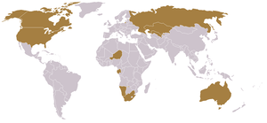
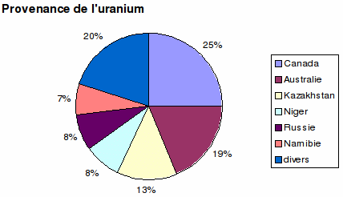
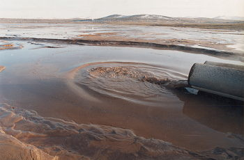

# Les problèmes de l'uranium

## L'économie minière de l'uranium dans le monde

### Production actuelle

10 pays produisent 94 % de l'uranium extrait dans le monde

En 2006, les principaux pays producteurs (pour une production globale de
l'ordre de 40 000 tonnes d'U) sont:

Il est intéressant de regarder de plus près la situation dans les deux pays suivants :

#### France :

On compte en France près de 170 anciens sites d'extraction et de traitement des minerais d'uranium. Tous ces sites ont représenté une production d'environ 72 800 tonnes d'uranium. L'activité minière française d'uranium a pris fin en mai 2001.

En février 2009 éclatait « Le scandale de la France contaminée », dénonçant la dissémination clandestine de grandes quantités de déchets minières radioactifs.

#### Le Niger :

Depuis près de quarante ans, Areva exploite près d'Arlit, à 150 km d'Agadez, une gigantesque mine à ciel ouvert. Au fur et à mesure que les mines d'uranium en France ont été fermées, le chantier d'Arlit a grossi. Les poussières radioactives, issues des montagnes de résidus, plongent la ville dans une atmosphère suffocante, provoquant la contamination des eaux et la destruction de la faune et de la flore à des dizaines de kilomètres autour des mines. Des ferrailles contaminées sont abandonnées. En 2003, la Commission de recherche et d'information indépendantes sur la radioactivité (Criirad), lors d'une mission au Niger, et malgré la confiscation de son matériel, a pu observer une contamination radioactive généralisée dans l'air et l'eau, ainsi que sur les ferrailles récupérées par les habitants. L'épuisement d'une des deux grandes nappes phréatique de la région, à hauteur de 70 %, est également préoccupant. À moyen terme, son irréversibilité est prévisible, ce qui rendra la vie purement et simplement impossible dans cette région. Il y a, de plus, de nombreuses pollutions annexes, essentiellement dues aux activités périphériques comme celles des carrières de charbon et des centrales thermiques, nécessaires pour la production de l’uranium. L'hôpital qui effectue les diagnostics étant géré par Areva, il n'y a aucun moyen de connaître réellement l'impact sur la santé des populations et des travailleurs. Mais le pire est à craindre.

#### France :

On compte en France près de 170 anciens sites d'extraction et de traitement des minerais d'uranium. Tous ces sites ont représenté une production d'environ 72 800 tonnes d'uranium. L'activité minière française d'uranium a pris fin en mai 2001.

En février 2009 éclatait « Le scandale de la France contaminée », dénonçant la dissémination clandestine de grandes quantités de déchets minières radioactifs.

### Perspective de production

Tout comme la production du pétrole, celle de l’uranium connaîtra aussi son peak, comme le montre le graphique suivant :

Source : "Uranium Resources and Nuclear Energy" du Energy Watch Group
(2006-12)

Cette illustration montre bien que

- plus qu’on avance dans le temps, plus cher devient l’uranium, parce qu’il faudra exploiter des mines toujours moins riches en uranium.
- à cause de cette faible teneur en uranium, il faudra déplacer toujours plus de roches et les procédés de concentration deviendront toujours plus énergievore.
- l’émission de CO2 augmentera donc d’une manière inacceptable.
- finalement, on atteindra le point où la production de l’uranium coûtera d’avantage d’énergie que uranium gagné ainsi ne pourra jamais produire.

## Les dangers de l'uranium

Il est de bon ton aujourd'hui de prétendre que l'énergie nucléaire est une énergie propre. Mais c'est oublier un peu vite beaucoup d'éléments dont l'enrichissement de l'uranium.

Prenons l'exemple du Niger. A Arlit, une ville de 840'000 habitants à 1200 km de Niamey au milieu du désert, il y a deux mines d'uranium : l'une à ciel ouvert exploitée par la SOMAÏR et l'autre, souterraine, exploitée par la COMINAK. Ces mines sont en fonction depuis plus de 40 ans. La SOMAÏR et la COMINAK sont deux filières de la firme française AREVA. Rappelons que les centrales suisses s'approvisionnent, entre autre, chez AREVA.

### Les risques pour la santé des mineurs et leurs familles.

Les mineurs qui travaillent dans ces mines n'ont aucune idée de ce qu'est l'uranium et encore moins de sa dangerosité. C'est seulement après l'accident de Tchernobyl que les dirigeants de la mine ont demandé aux mineurs de se laver les mains avant de manger et prendre certaines dispositions minimales de sécurité. Comme ils ne leur ont pas expliqué pourquoi, ces derniers étaient vexés qu'on leur demande cela et ne le faisaient pas. Jusqu'en 2006, les mineurs rentraient à leur domicile avec leur vêtement de travail couvert de poussières radioactives et c'est leur femme qui le lavait. Heureusement, ces dernières ayant compris le danger, se sont rebellées et ces habits sont maintenant lavés à l'usine. C'est aussi depuis l'année dernière seulement qu'ils ont pris des précautions pour transporter les concentrés uranifères. Auparavant, ils étaient déposés simplement à l'air libre sur le pont des camions pour être transportés jusqu'à la capitale. Il arrivait fréquemment que le chauffeur, voulant rendre service à ses amis, accompagnés souvent de sacs de nourriture, les embarque sur son camion.

Les dirigeants de la mine avaient aussi pour habitude d'offrir les vieilles ferrailles de la mine à leurs ouvriers. Ces derniers les revendaient aux ferrailleurs de la ville d'Arlit. Puis la transformation de ces vieilles ferrailles pouvait commencer, notamment en casseroles, cadres de fenêtres, plafonds des maisons, etc. Un rapport de la Commission de recherche et d'information indépendantes sur la radioactivité a récemment montré que ces objets et ustensiles étaient contaminés et avaient été vendus dans tout le pays. Cela implique des conséquences sanitaires grave pour toutes les populations locales.

### Les risques pour l'environnement

Par ailleurs, pour le traitement du minerai d’uranium dans les usines de la SOMAIR et de la COMINAK, il faut beaucoup d'eau. Comme les mines se trouvent en plein désert, ils ont puisé toute l'eau des nappes phréatiques et ils s'attaquent maintenant aux nappes fossiles, à plus de 300 m de profondeur (il faut 500 ans pour les régénérer). La région ne comporte pratiquement plus d'arbres, puisque ces derniers ne peuvent aller chercher l'eau dont ils ont besoin qu'à 60 m de profondeur. Avant, il suffisait de faire 10 km pour trouver du bois, alors que maintenant, les arbres se trouvent à plus de 300 km. Non content de vider les nappes phréatiques, la plupart de celles qui alimentent la ville sont contaminées.

Lorsque l'on extrait de l'uranium, une part bien inférieure à 1% est constituée d'uranium fissile. Le traitement du minerai génère donc de grandes quantités de déchets : 45 millions de tonnes depuis 40 ans, stockées à l'air libre. Ces poussières contiennent encore 80% de la radioactivité. En effet, l’extraction chimique entraîne bien l’uranium mais pratiquement pas les métaux lourds radioactifs (thorium 230, radium 226, plomb 210, etc.) qui lui sont associés. Ces poussières radioactives sont soumises aux vents violents coutumiers dans le désert et, du même coup, contaminent toute la région.

Comme si cela ne suffisait pas, le traitement de l'uranium nécessite de grandes quantités d'acide sulfurique. Celui-ci est produit directement sur place dans des conditions lamentables. Cette fabrication génère des pluies acides, qui ont détruit toute la flore locale. La faune, ne trouvant plus d'herbe, a également reculé et les environs de la ville d'Arlit sont maintenant bien vides. Les eaux usées de l'usine se déversent dans un grand bassin, de nombreux oiseaux migrateurs s'y arrêtent pour boire et malheureusement leur voyage s'arrête là.

### L’énergie nécessaire pour la production de l’uranium

Toutes ces transformations nécessitent beaucoup d'énergie. C'est une centrale à charbon qui approvisionne en électricité le site. Les fumées de la centrale sont extrêmement polluantes et, en plus du CO2 dégagé, des suies se déposent dans tous les alentours. La SOMAÏR et la COMINAK disposent en outre de groupes diesel de secours. La consommation électrique annuelle est de plus de 90 GWh. Elles utilisent par ailleurs plus de 10'000 m3 de pétrole (carburant des engins de mine et des véhicules ; séchage du minerai et de l’uranate). Ainsi, s’agissant des données COMINAK de 2002, la production d’une tonne d’uranium nécessite 9,7 tonnes d’équivalent pétrole, sans compter l’énergie nécessaire à l’extraction du charbon, à la production et au transport sur site des consommables utilisés : soufre (11'768 t), ciment (5'160 t), chlorure de sodium (3'799 t), carbonate de sodium (2'955 t), nitrate d’ammonium (1'487 t), magnésie (637 t), explosifs (325 t), soude caustique (211 t), etc. Le bilan énergétique n’est pas fourni dans le rapport SOMAÏR 2004, mais il est probablement moins bon que celui de COMINAK dans la mesure où la teneur en uranium des minerais extraits par SOMAÏR est nettement inférieure (3 kg d’uranium par tonne de minerai contre 5 pour COMINAK).

### Les problèmes sociaux.

Comme si les catastrophes écologiques ne suffisaient pas, on peut ajouter les problèmes sociaux. Plus de 40% des 3'000 travailleurs des deux mines sont des intérimaires. Ils ne bénéficient d'aucun soutien médical, ni de retraite. De manière générale, les filiales d'AREVA annoncent qu'en 30 ans d'exploitation, ils n'ont relevé aucun cas de maladie liée au travail. C'est oublier un peu vite tous ces travailleurs morts de cancers. Mais ils sont malins et, afin de masquer les cancers, les hôpitaux des mineurs ont acquis très vite un laboratoire pour détecter le virus du Sida. Lorsque les familles demandent de quoi souffre le patient, les médecins répondent qu'il est "malade", sans autre précision.

Vous pensez que ça ne peut pas être pire? Navrée de vous annoncer que plus de 120 permis d'exploitation ont été délivrés, l'année dernière, par le gouvernement nigérien à des exploitants du monde entier dont des Chinois, des Canadiens, des Sud Africains, etc. Que restera-t-il du Niger dans 50 ans ?

Heureusement, une association existe depuis 2001 et dénonce tous ces faits. Il s'agit d'Aghir in man. Aghir in Man participe, entre autres, à la sensibilisation, à l’information et à la formation des populations, éléments essentiels pour que les Hommes puissent dénoncer l'inacceptable.

### Conclusion.

Lorsqu'on parle d'énergie nucléaire, il serait bon de ne pas oublier la provenance de l'uranium que l'on utilise dans nos centrales, ne serait-ce que par honnêteté intellectuelle. Le nucléaire est une plaie du début à la fin.

Dr Isabelle Chevalley

## Brillantes affaires en terres indiennes

Environ 80% du minerai d’uranium est extrait sur le territoire de peuples primitifs, sans qu’ils aient voix au chapitre et sans qu’ils tirent un quelconque bénéficie des milliards engendrés. Mais ils en paient les conséquences: les sols et les eaux souterraines sont contaminés, et le taux de cancers augmente.

### AREVA: une insatiable soif d'uranium

AREVA (autrefois COGEMA), la plus grande entreprise nucléaire à l’échelle mondiale, est à juste titre titulaire du prix Public Eye Global Award 2008. De fait, avec des représentations dans plus de 40 pays, elle est parvenue comme aucune autre grande entreprise à profiter de la faiblesse de populations indigènes et, en brandissant le leurre de nouvelles places de travail, à concentrer entre ses mains toute la « chaîne de l’uranium », de l’extraction jusqu’au dépôt final – tout ceci sans se soucier des droits humains.

### L'exemple du Canada

Dès 1933 environ, la COGEMA, ancêtre d’AREVA, a acheté une multitude de petites firmes engagées dans des projets liés à l’uranium, et s’est elle-même procurée des participations dans presque tous les gisements significatifs d’uranium. Entre-temps, COGEMA/AREVA s’est, de pair avec CAMECO, immiscée dans tous les domaines de la chaîne des combustibles.

La mine d’uranium de McArthur River, dans la province canadienne du Saskatchewan, est le plus gros producteur d’uranium au monde. AREVA/COGEMA est copropriétaire de la mine à hauteur de 30,2%, en compagnie de CAMECO (69,8%). Il y a trois ans environ, la mine a été inondée par une fuite d’eau totalement « imprévisible » –  en réalité, une fuite d’eau n’ayant pas été correctement évaluée par les responsables de la mine. L’exploitation minière a toutefois pu reprendre par la suite.

AREVA/COGEMA possède en outre une participation de 37,1% dans la Cigar Lake Mining Corporation (CMLC). Cigar Lake, qui se trouve également dans la province du Saskatchewan, contient l’uranium naturellement le plus enrichi, mais également des mesures de sécurité particulièrement lacunaires: il y a 2 ans, une fuite d’eau a noyé la mine et mis en danger des mineurs. L’entreprise exploitante reconnaît elle-même que la mine ne peut plus être exploitée sur plusieurs années. Mais les mineurs qui ont parlé en public des mesures de sécurité déficientes sont confrontés à des représailles (p.ex. pas de réengagement). Les exploitants déclarent qu’ils ne veulent pas abandonner le gisement de 150'000 tonnes d’uranium.

À l’heure actuelle, le Nunavut (territoire au Nord-Ouest du Canada cédé il y a quelques années à la population des Inuits avec un statut autonome) est au centre de l’intérêt d’entreprises actives dans l’exploitation d’uranium. Avec les gisements de Kiggavik, End et Andrew Lake, le territoire du Baker Lake abrite le plus grand gisement d’uranium du Canada. AREVA est de la partie et étudie les possibilités de production du gisement de Kiggavik-Sisson, estimées à environ 65'000 tonnes d’uranium 308 (U308).  

### Un lourd tribut à payer

Les problèmes provoqués par les résidus toxiques liés à l’extraction d’uranium ne sont toujours pas résolus: d’immenses terrils constitués par la pluie et le vent s’amoncèlent aux abords des mines, et les particules radioactives qui ruissellent et sont soufflées contaminent l’air et l’eau. Comme des produits chimiques agressifs sont utilisés pour transformer le minerai d’uranium, les eaux et les sols de la région sont de surcroît empoisonnés par des résidus d’acide sulfurique, de mercure ou d’arsenic. Dans les mines souterraines, aucune aération efficace protégeant contre la radioactivité n’a encore été mise en place. Beaucoup de travailleurs indiens sont par conséquent tombés malades, atteints de cancers du poumon et de leucémies. On leur a très souvent mis à disposition, en guise de salaire, du matériel pour la construction d’habitations provenant des mines d’uranium. Des familles entières ont ainsi respiré pendant des années de l’air radioactif dans les pièces des leurs maisons. Certes, les entreprises exploitantes agissent aujourd’hui de manière plus prudente. Mais les problèmes pour les êtres humains et l’environnement persistent.

«Quand vous allumez la lumière chez vous, la vie s’arrête chez nous.»  
(Tom LaBlanc, Sisseton Dakota)

_Auteure: Helena Nyberg, AG Uran, INCOMINDIOS_
