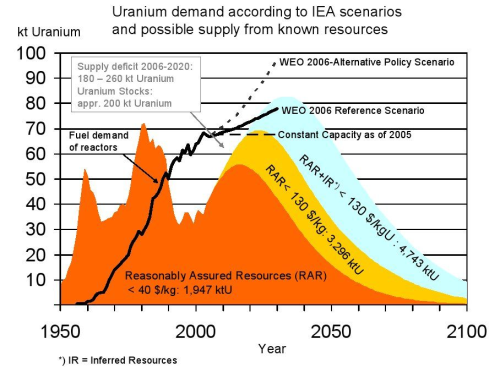

# Les problèmes de l'uranium

## L'economie miniere de l'uranium dans le monde

### Production actuelle

10 pays produisent 94 % de l'uranium extrait dans le monde

En 2006, les principaux pays producteurs (pour une production globale de
l'ordre de 40 000 tonnes d'U) sont:

Il est interessant de regarder de plus pres la situation dans les deux pays
suivants :

#### France :

On compte en France pres de 170 anciens sites d'extraction et de traitement
des minerais d'uranium. Tous ces sites ont represente une production d'environ
72 800 tonnes d'uranium. L'activite miniere française d'uranium a pris fin en
mai 2001.

En fevrier 2009 eclatait « Le scandale de la France contaminee », denonçant la
dissemination clandestine de grandes quantites de dechets minieres
radioactifs.

#### Le Niger :

Depuis pres de quarante ans, Areva exploite pres d'Arlit, a 150 km d'Agadez,
une gigantesque mine a ciel ouvert. Au fur et a mesure que les mines d'uranium
en France ont ete fermees, le chantier d'Arlit a grossi. Les poussieres
radioactives, issues des montagnes de residus, plongent la ville dans une
atmosphere suffocante, provoquant la contamination des eaux et la destruction
de la faune et de la flore a des dizaines de kilometres autour des mines. Des
ferrailles contaminees sont abandonnees. En 2003, la Commission de recherche
et d'information independantes sur la radioactivite (Criirad), lors d'une
mission au Niger, et malgre la confiscation de son materiel, a pu observer une
contamination radioactive generalisee dans l'air et l'eau, ainsi que sur les
ferrailles recuperees par les habitants. L'epuisement d'une des deux grandes
nappes phreatique de la region, a hauteur de 70 %, est egalement preoccupant.
À moyen terme, son irreversibilite est previsible, ce qui rendra la vie
purement et simplement impossible dans cette region. Il y a, de plus, de
nombreuses pollutions annexes, essentiellement dues aux activites
peripheriques comme celles des carrieres de charbon et des centrales
thermiques, necessaires pour la production de l'uranium. L'hopital qui
effectue les diagnostics etant gere par Areva, il n'y a aucun moyen de
connaitre reellement l'impact sur la sante des populations et des
travailleurs. Mais le pire est a craindre.

#### France :

On compte en France pres de 170 anciens sites d'extraction et de traitement
des minerais d'uranium. Tous ces sites ont represente une production d'environ
72 800 tonnes d'uranium. L'activite miniere française d'uranium a pris fin en
mai 2001.

En fevrier 2009 eclatait « Le scandale de la France contaminee », denonçant la
dissemination clandestine de grandes quantites de dechets minieres
radioactifs.

### Perspective de production

Tout comme la production du petrole, celle de l'uranium connaitra aussi son
peak, comme le montre le graphique suivant :

Source : "Uranium Resources and Nuclear Energy" du Energy Watch Group
(2006-12)

Cette illustration montre bien que

  * plus qu'on avance dans le temps, plus cher devient l'uranium, parce qu'il faudra exploiter des mines toujours moins riches en uranium.
  * a cause de cette faible teneur en uranium, il faudra deplacer toujours plus de roches et les procedes de concentration deviendront toujours plus energievore.
  * l'emission de CO2 augmentera donc d'une maniere inacceptable.
  * finalement, on atteindra le point ou la production de l'uranium coutera d'avantage d'energie que uranium gagne ainsi ne pourra jamais produire.

## Les dangers de l'uranium

Il est de bon ton aujourd'hui de pretendre que l'energie nucleaire est une
energie propre. Mais c'est oublier un peu vite beaucoup d'elements dont
l'enrichissement de l'uranium.

Prenons l'exemple du Niger. A Arlit, une ville de 840'000 habitants a 1200 km
de Niamey au milieu du desert, il y a deux mines d'uranium : l'une a ciel
ouvert exploitee par la SOMAÏR et l'autre, souterraine, exploitee par la
COMINAK. Ces mines sont en fonction depuis plus de 40 ans. La SOMAÏR et la
COMINAK sont deux filieres de la firme française AREVA. Rappelons que les
centrales suisses s'approvisionnent, entre autre, chez AREVA.

### Les risques pour la sante des mineurs et leurs familles.

Les mineurs qui travaillent dans ces mines n'ont aucune idee de ce qu'est
l'uranium et encore moins de sa dangerosite. C'est seulement apres l'accident
de Tchernobyl que les dirigeants de la mine ont demande aux mineurs de se
laver les mains avant de manger et prendre certaines dispositions minimales de
securite. Comme ils ne leur ont pas explique pourquoi, ces derniers etaient
vexes qu'on leur demande cela et ne le faisaient pas. Jusqu'en 2006, les
mineurs rentraient a leur domicile avec leur vetement de travail couvert de
poussieres radioactives et c'est leur femme qui le lavait. Heureusement, ces
dernieres ayant compris le danger, se sont rebellees et ces habits sont
maintenant laves a l'usine. C'est aussi depuis l'annee derniere seulement
qu'ils ont pris des precautions pour transporter les concentres uraniferes.
Auparavant, ils etaient deposes simplement a l'air libre sur le pont des
camions pour etre transportes jusqu'a la capitale. Il arrivait frequemment que
le chauffeur, voulant rendre service a ses amis, accompagnes souvent de sacs
de nourriture, les embarque sur son camion.

Les dirigeants de la mine avaient aussi pour habitude d'offrir les vieilles
ferrailles de la mine a leurs ouvriers. Ces derniers les revendaient aux
ferrailleurs de la ville d'Arlit. Puis la transformation de ces vieilles
ferrailles pouvait commencer, notamment en casseroles, cadres de fenetres,
plafonds des maisons, etc. Un rapport de la Commission de recherche et
d'information independantes sur la radioactivite a recemment montre que ces
objets et ustensiles etaient contamines et avaient ete vendus dans tout le
pays. Cela implique des consequences sanitaires grave pour toutes les
populations locales.

### Les risques pour l'environnement

Par ailleurs, pour le traitement du minerai d'uranium dans les usines de la
SOMAIR et de la COMINAK, il faut beaucoup d'eau. Comme les mines se trouvent
en plein desert, ils ont puise toute l'eau des nappes phreatiques et ils
s'attaquent maintenant aux nappes fossiles, a plus de 300 m de profondeur (il
faut 500 ans pour les regenerer). La region ne comporte pratiquement plus
d'arbres, puisque ces derniers ne peuvent aller chercher l'eau dont ils ont
besoin qu'a 60 m de profondeur. Avant, il suffisait de faire 10 km pour
trouver du bois, alors que maintenant, les arbres se trouvent a plus de 300
km. Non content de vider les nappes phreatiques, la plupart de celles qui
alimentent la ville sont contaminees.

Lorsque l'on extrait de l'uranium, une part bien inferieure a 1% est
constituee d'uranium fissile. Le traitement du minerai genere donc de grandes
quantites de dechets : 45 millions de tonnes depuis 40 ans, stockees a l'air
libre. Ces poussieres contiennent encore 80% de la radioactivite. En effet,
l'extraction chimique entraine bien l'uranium mais pratiquement pas les metaux
lourds radioactifs (thorium 230, radium 226, plomb 210, etc.) qui lui sont
associes. Ces poussieres radioactives sont soumises aux vents violents
coutumiers dans le desert et, du meme coup, contaminent toute la region.

Comme si cela ne suffisait pas, le traitement de l'uranium necessite de
grandes quantites d'acide sulfurique. Celui-ci est produit directement sur
place dans des conditions lamentables. Cette fabrication genere des pluies
acides, qui ont detruit toute la flore locale. La faune, ne trouvant plus
d'herbe, a egalement recule et les environs de la ville d'Arlit sont
maintenant bien vides. Les eaux usees de l'usine se deversent dans un grand
bassin, de nombreux oiseaux migrateurs s'y arretent pour boire et
malheureusement leur voyage s'arrete la.

### L'energie necessaire pour la production de l'uranium

Toutes ces transformations necessitent beaucoup d'energie. C'est une centrale
a charbon qui approvisionne en electricite le site. Les fumees de la centrale
sont extremement polluantes et, en plus du CO2 degage, des suies se deposent
dans tous les alentours. La SOMAÏR et la COMINAK disposent en outre de groupes
diesel de secours. La consommation electrique annuelle est de plus de 90 GWh.
Elles utilisent par ailleurs plus de 10'000 m3 de petrole (carburant des
engins de mine et des vehicules ; sechage du minerai et de l'uranate). Ainsi,
s'agissant des donnees COMINAK de 2002, la production d'une tonne d'uranium
necessite 9,7 tonnes d'equivalent petrole, sans compter l'energie necessaire a
l'extraction du charbon, a la production et au transport sur site des
consommables utilises : soufre (11'768 t), ciment (5'160 t), chlorure de
sodium (3'799 t), carbonate de sodium (2'955 t), nitrate d'ammonium (1'487 t),
magnesie (637 t), explosifs (325 t), soude caustique (211 t), etc. Le bilan
energetique n'est pas fourni dans le rapport SOMAÏR 2004, mais il est
probablement moins bon que celui de COMINAK dans la mesure ou la teneur en
uranium des minerais extraits par SOMAÏR est nettement inferieure (3 kg
d'uranium par tonne de minerai contre 5 pour COMINAK).

### Les problemes sociaux.

Comme si les catastrophes ecologiques ne suffisaient pas, on peut ajouter les
problemes sociaux. Plus de 40% des 3'000 travailleurs des deux mines sont des
interimaires. Ils ne beneficient d'aucun soutien medical, ni de retraite. De
maniere generale, les filiales d'AREVA annoncent qu'en 30 ans d'exploitation,
ils n'ont releve aucun cas de maladie liee au travail. C'est oublier un peu
vite tous ces travailleurs morts de cancers. Mais ils sont malins et, afin de
masquer les cancers, les hopitaux des mineurs ont acquis tres vite un
laboratoire pour detecter le virus du Sida. Lorsque les familles demandent de
quoi souffre le patient, les medecins repondent qu'il est "malade", sans autre
precision.

Vous pensez que ça ne peut pas etre pire? Navree de vous annoncer que plus de
120 permis d'exploitation ont ete delivres, l'annee derniere, par le
gouvernement nigerien a des exploitants du monde entier dont des Chinois, des
Canadiens, des Sud Africains, etc. Que restera-t-il du Niger dans 50 ans ?

Heureusement, une association existe depuis 2001 et denonce tous ces faits. Il
s'agit d'_Aghir in man_. Vous pouvez en savoir plus en allant sur le site:
[www.aghirinman.org](http://www.aghirinman.org/). Vous pouvez egalement leur
faire un don. Aghir in Man participe, entre autres, a la sensibilisation, a
l'information et a la formation des populations, elements essentiels pour que
les Hommes puissent denoncer l'inacceptable.

### Conclusion.

Lorsqu'on parle d'energie nucleaire, il serait bon de ne pas oublier la
provenance de l'uranium que l'on utilise dans nos centrales, ne serait-ce que
par honnetete intellectuelle. Le nucleaire est une plaie du debut a la fin.

Dr Isabelle Chevalley

## Brillantes affaires en terres indiennes

Environ 80% du minerai d'uranium est extrait sur le territoire de peuples
primitifs, sans qu'ils aient voix au chapitre et sans qu'ils tirent un
quelconque beneficie des milliards engendres. Mais ils en paient les
consequences: les sols et les eaux souterraines sont contamines, et le taux de
cancers augmente.

### AREVA: une insatiable soif d'uranium

AREVA (autrefois COGEMA), la plus grande entreprise nucleaire a l'echelle
mondiale, est a juste titre titulaire du prix Public Eye Global Award 2008. De
fait, avec des representations dans plus de 40 pays, elle est parvenue comme
aucune autre grande entreprise a profiter de la faiblesse de populations
indigenes et, en brandissant le leurre de nouvelles places de travail, a
concentrer entre ses mains toute la « chaine de l'uranium », de l'extraction
jusqu'au depot final - tout ceci sans se soucier des droits humains.

### L'exemple du Canada

Des 1933 environ, la COGEMA, ancetre d'AREVA, a achete une multitude de
petites firmes engagees dans des projets lies a l'uranium, et s'est elle-meme
procuree des participations dans presque tous les gisements significatifs
d'uranium. Entre-temps, COGEMA/AREVA s'est, de pair avec CAMECO, immiscee dans
tous les domaines de la chaine des combustibles.

La mine d'uranium de McArthur River, dans la province canadienne du
Saskatchewan, est le plus gros producteur d'uranium au monde. AREVA/COGEMA est
coproprietaire de la mine a hauteur de 30,2%, en compagnie de CAMECO (69,8%).
Il y a trois ans environ, la mine a ete inondee par une fuite d'eau totalement
« imprevisible » -  en realite, une fuite d'eau n'ayant pas ete correctement
evaluee par les responsables de la mine. L'exploitation miniere a toutefois pu
reprendre par la suite.

AREVA/COGEMA possede en outre une participation de 37,1% dans la Cigar Lake
Mining Corporation (CMLC). Cigar Lake, qui se trouve egalement dans la
province du Saskatchewan, contient l'uranium naturellement le plus enrichi,
mais egalement des mesures de securite particulierement lacunaires: il y a 2
ans, une fuite d'eau a noye la mine et mis en danger des mineurs. L'entreprise
exploitante reconnait elle-meme que la mine ne peut plus etre exploitee sur
plusieurs annees. Mais les mineurs qui ont parle en public des mesures de
securite deficientes sont confrontes a des represailles (p.ex. pas de
reengagement). Les exploitants declarent qu'ils ne veulent pas abandonner le
gisement de 150'000 tonnes d'uranium.

À l'heure actuelle, le Nunavut (territoire au Nord-Ouest du Canada cede il y a
quelques annees a la population des Inuits avec un statut autonome) est au
centre de l'interet d'entreprises actives dans l'exploitation d'uranium. Avec
les gisements de Kiggavik, End et Andrew Lake, le territoire du Baker Lake
abrite le plus grand gisement d'uranium du Canada. AREVA est de la partie et
etudie les possibilites de production du gisement de Kiggavik-Sisson, estimees
a environ 65'000 tonnes d'uranium 308 (U308).  

### Un lourd tribut a payer

Les problemes provoques par les residus toxiques lies a l'extraction d'uranium
ne sont toujours pas resolus: d'immenses terrils constitues par la pluie et le
vent s'amoncelent aux abords des mines, et les particules radioactives qui
ruissellent et sont soufflees contaminent l'air et l'eau. Comme des produits
chimiques agressifs sont utilises pour transformer le minerai d'uranium, les
eaux et les sols de la region sont de surcroit empoisonnes par des residus
d'acide sulfurique, de mercure ou d'arsenic. Dans les mines souterraines,
aucune aeration efficace protegeant contre la radioactivite n'a encore ete
mise en place. Beaucoup de travailleurs indiens sont par consequent tombes
malades, atteints de cancers du poumon et de leucemies. On leur a tres souvent
mis a disposition, en guise de salaire, du materiel pour la construction
d'habitations provenant des mines d'uranium. Des familles entieres ont ainsi
respire pendant des annees de l'air radioactif dans les pieces des leurs
maisons. Certes, les entreprises exploitantes agissent aujourd'hui de maniere
plus prudente. Mais les problemes pour les etres humains et l'environnement
persistent.

«Quand vous allumez la lumiere chez vous, la vie s'arrete chez nous.»  
(Tom LaBlanc, Sisseton Dakota)

_Auteure: Helena Nyberg, AG Uran, INCOMINDIOS_
